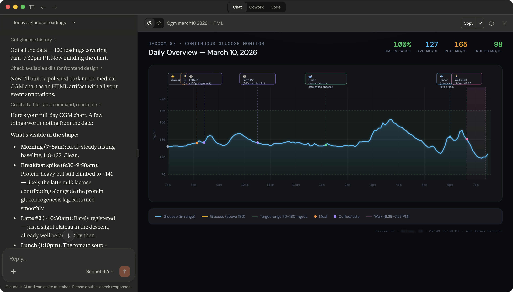
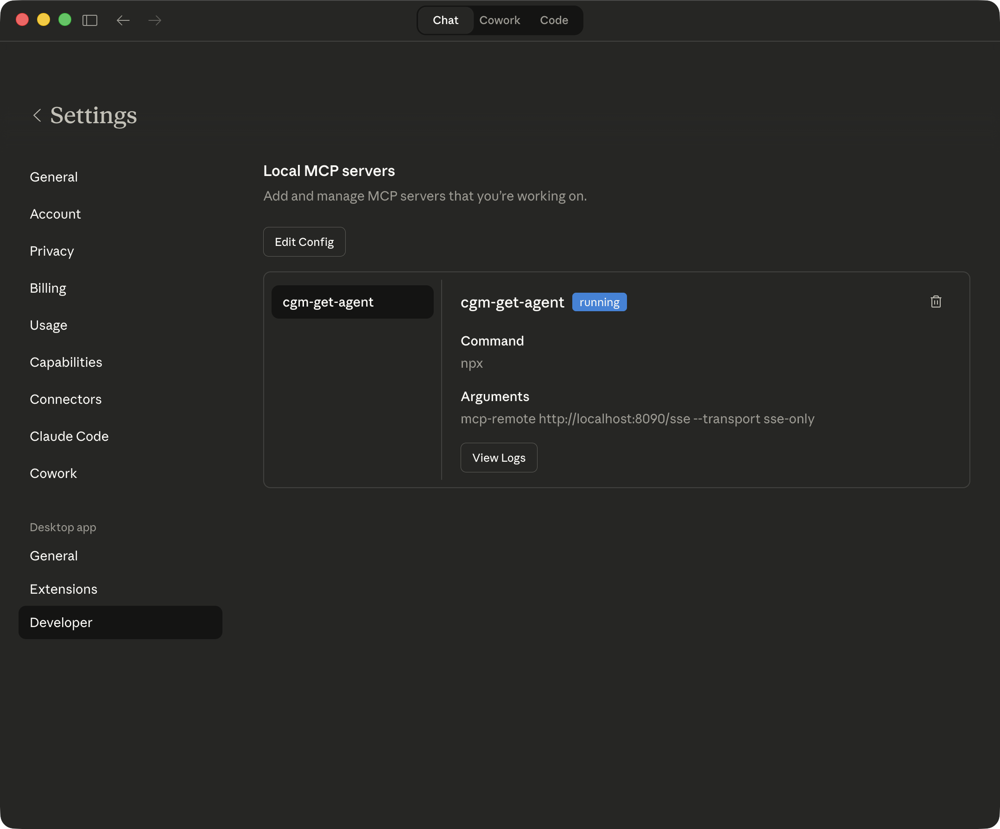
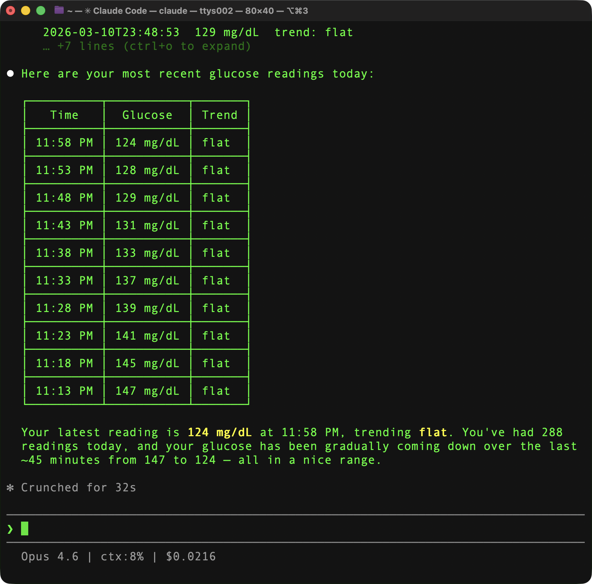

# CGM Get Agent — Quick Start

Connect your Dexcom G7 CGM to Claude Desktop or ChatGPT Desktop in about 15 minutes.



---

## What This Does

CGM Get Agent runs as a local Docker container that exposes your Dexcom G7 data as MCP tools. Once connected, you can ask Claude or ChatGPT questions like:

- *"What's my glucose right now and where is it headed?"*
- *"I just had a bowl of oatmeal — log it and tell me what I'm starting from."*
- *"How did that burrito I had at lunch hit me?"*
- *"Did my CGM alarm go off last night?"*

---

## Prerequisites

| Requirement | Notes |
|---|---|
| macOS (Apple Silicon) | Intel Mac works with minor Dockerfile changes |
| [Colima](https://github.com/abiosoft/colima) + Docker CLI | `brew install colima docker docker-compose` |
| Dexcom G7 + iOS app | Active sensor and Dexcom cloud account required |
| [Dexcom developer account](https://developer.dexcom.com) | Free to register |
| Claude Desktop or ChatGPT Desktop | Any recent version with MCP support |

---

## Step 1 — Register Your Own Dexcom Developer App

You need **your own** Client ID and Client Secret. Each user must register their own Dexcom developer application — do not use or share anyone else's credentials.

1. Go to [developer.dexcom.com](https://developer.dexcom.com) and create an account or sign in.
2. Register a new application.
3. Set the **Redirect URI** to: `http://localhost:8090/callback`
   > **Using a different port?** The installer will ask for your port and set the redirect URI automatically. Make sure the Dexcom developer portal Redirect URI matches exactly.
4. Copy your **Client ID** and **Client Secret** — the installer will prompt for them.

> **Access tiers**: A new Dexcom Developer Account starts at the **Registered Developer** tier, which only grants **sandbox access** (simulated data). To access your **real glucose data**, apply for an **Individual Access** upgrade within your app profile on the Dexcom developer portal. After upgrading, you must authorize the app via OAuth — data access is opt-in and can be revoked at any time.
>
> Start with sandbox (`GA_DEXCOM_ENV=sandbox`) to verify everything works, then switch to production after Individual Access is approved.

---

## Step 2 — Install and Configure

```bash
# Clone the repo
git clone https://github.com/johnmartinez/cgm-get-agent.git
cd cgm-get-agent

# Create the data directory
mkdir -p ~/.cgm-get-agent
chmod 700 ~/.cgm-get-agent

# Copy and fill in the environment file
cp .env.example .env
```

Edit `.env` with your values:

```bash
GA_DEXCOM_CLIENT_ID=your-client-id-from-dexcom
GA_DEXCOM_CLIENT_SECRET=your-client-secret-from-dexcom
GA_DEXCOM_ENV=sandbox          # or "production" for live CGM data
GA_ENCRYPTION_KEY=$(openssl rand -hex 32)
GA_MCP_TRANSPORT=sse
GA_SERVER_PORT=8090
```

> **Keep `.env` private.** It is gitignored and must never be committed.

---

## Step 3 — Start the Container

```bash
# Start Colima if it isn't already running
colima start --arch aarch64 --vm-type vz

# Build and start the agent
docker compose up --build -d

# Confirm it's healthy
docker compose ps
curl http://localhost:8090/health
```

Expected health response before OAuth:

```json
{"status":"degraded","dexcom_auth":"not_configured","db_accessible":true,"uptime_seconds":3}
```

---

## Step 4 — Authorize Dexcom (One-Time)

1. Open **http://localhost:8090/oauth/start** in your browser.
2. Log in to your Dexcom account and complete the HIPAA authorization screen.
3. You'll be redirected back with a success message.

Verify authorization succeeded:

```bash
curl http://localhost:8090/health
```

```json
{"status":"ok","dexcom_auth":"valid","db_accessible":true,"uptime_seconds":42}
```

OAuth tokens are encrypted with AES-256-GCM and stored at `~/.cgm-get-agent/tokens.enc`. They are never logged or sent anywhere except to Dexcom's API.

---

## Step 5 — Connect Claude Desktop

Claude Desktop only supports stdio transport in its local config — it cannot connect to an SSE endpoint directly. Use `mcp-remote` (via npx) as a stdio-to-SSE bridge.

**Prerequisite:** Node.js must be installed (`brew install node`).

Edit Claude Desktop's MCP config file:

**`~/Library/Application Support/Claude/claude_desktop_config.json`**

```json
{
  "mcpServers": {
    "cgm-get-agent": {
      "command": "npx",
      "args": [
        "mcp-remote",
        "http://localhost:8090/sse",
        "--transport",
        "sse-only"
      ]
    }
  }
}
```

Restart Claude Desktop. You should see **cgm-get-agent** in Developer Settings with a green "running" badge:



The 11 tools will be available in the tools panel (the hammer icon).

> **Claude Code CLI (SSE, no bridge needed):**
> ```bash
> claude mcp add --transport sse cgm-get-agent http://localhost:8090/sse
> ```
>
> 

> **stdio transport (experimental — not yet validated):** Runs a fresh server process per session with no HTTP layer. May cause JSON-RPC corruption errors.
> ```bash
> claude mcp add cgm-get-agent -- docker exec -e GA_MCP_TRANSPORT=stdio -i cgm-get-agent cgm-get-agent serve
> ```

---

## Step 6 — Connect ChatGPT Desktop

ChatGPT Desktop supports MCP via SSE. To add the server:

1. Open **ChatGPT Desktop** → **Settings** → **Connectors** (or **MCP Servers**).
2. Add a new server with URL: `http://localhost:8090/sse`
3. Name it `cgm-get-agent`.
4. Save and restart ChatGPT Desktop.

The 11 tools will be available automatically in any conversation.

> If your version of ChatGPT Desktop uses a config file instead of the UI, create or edit:
> **`~/Library/Application Support/ChatGPT/mcp.json`**
> ```json
> {
>   "servers": [
>     {
>       "name": "cgm-get-agent",
>       "transport": "sse",
>       "url": "http://localhost:8090/sse"
>     }
>   ]
> }
> ```

---

## Test It

Try these prompts after connecting:

```
What's my glucose right now?
```

```
I just had two slices of sourdough toast with peanut butter. Log it and show me my current trend.
```

```
Did my Dexcom alarm go off at any point last night?
```

```
How did the meal I logged at lunch impact my glucose? Give it a rating.
```

---

## Available Tools

| Tool | Description |
|---|---|
| `get_current_glucose` | Current reading + trend + optional history window |
| `get_glucose_history` | Historical EGVs for a date range (max 30 days) |
| `get_trend` | Trend arrow, rate of change, and glucose zone |
| `get_dexcom_events` | Events logged in the G7 app (carbs, insulin, exercise, health) |
| `get_calibrations` | Fingerstick calibration records |
| `get_alerts` | CGM alert history (high, low, urgent low, rise, fall, etc.) |
| `get_devices` | G7 transmitter and display device info |
| `get_data_range` | Earliest/latest timestamps for each data type |
| `log_meal` | Log a meal locally with optional macro estimates |
| `log_exercise` | Log an exercise session locally |
| `rate_meal_impact` | Analyze glucose impact of a logged meal (1–10 rating) |

---

## Troubleshooting

**Health shows `dexcom_auth: not_configured`**
Visit `http://localhost:8090/oauth/start` and complete the Dexcom authorization flow.

**Health shows `dexcom_auth: expired`**
Your refresh token expired (rare). Re-authorize: `open http://localhost:8090/oauth/start`

**Tools show stale data notice**
Normal for US mobile users — the Dexcom cloud has a ~1 hour delay for G7 data uploaded via iOS. Data uploaded from a Dexcom receiver via USB arrives immediately.

**Port 8090 already in use**
Set both port vars in `.env` and update your Dexcom app's Redirect URI to match:
```bash
GA_SERVER_PORT=8090
GA_DEXCOM_REDIRECT_URI=http://localhost:8090/callback
```
Then replace every `8090` reference in this guide with your chosen port.

**Container won't start**
```bash
docker compose logs cgm-get-agent
```
Most common cause: missing or incorrect values in `.env`.

**Data gap after fresh install or re-authorization**
After a fresh install, rebuild with new tokens, or re-authorization, you may only see historical data from your previous auth session. Recent readings (last 1-2 hours) will backfill as the Dexcom API syncs with your new OAuth tokens. Wait an hour and try again — your G7 sensor has been uploading continuously, the API just needs time to serve it under the new authorization.

**Restart after reboot**
```bash
colima start --arch aarch64 --vm-type vz
docker compose up -d
```

---

## Switching to Production

When you're ready to use live CGM data:

1. Apply for an **Individual Access** upgrade on your existing app at [developer.dexcom.com](https://developer.dexcom.com). This grants access to your own production Dexcom data.
2. If your upgraded app has different credentials, update them in `.env`. If the credentials are the same, you only need to change `GA_DEXCOM_ENV`:
   ```bash
   GA_DEXCOM_ENV=production
   ```
3. Rebuild and re-authorize:
   ```bash
   make rehup
   make auth
   ```
